# Sentinel CLI

Sentinel is an academic research prototype for an **Autonomous Cyber-Physical Feedback Loop** that combines probabilistic multi-agent reasoning with deterministic EVM execution. It is intentionally a local, defensive tool for Solidity/Foundry projects.

## Architecture

```mermaid
flowchart LR
    A[Foundry project] --> B[Scout: Perceive]
    B --> C[Slither + Aderyn + solc context]
    C --> D[Gemini 1.5 Flash candidate]
    D --> E[Red Team: GPT-4o PoC]
    E --> F[Forge exploit validation]
    F -->|confirmed| G[Blue Team: DeepSeek-Coder-7B via Ollama]
    G --> H[Minimal Invasive Change]
    H --> I[Judge: forge build]
    I --> J[Exploit defense]
    J --> K[Original regression tests]
    K -->|failure, max 5| G
    K -->|pass| L[Markdown audit report]
```



The cognitive flow is **Perceive -> Reason -> Act -> Observe**:

- **Scout** combines static evidence and semantic context. It produces candidates only.
- **Red Team** creates an executable Foundry test. A finding becomes confirmed only when Forge proves the exploit in the local EVM.
- **Blue Team** proposes a targeted patch under the Minimal Invasive Change constraint.
- **Judge** is deterministic and is never an LLM. It requires build success, exploit neutralization, and regression success.

## Model assignments

The default architecture preserves the MPP1 report assignments: Google Gemini 1.5 Flash for Scout, OpenAI GPT-4o for Red Team, and DeepSeek-Coder-7B hosted through Ollama for Blue Team. Providers are isolated behind `LLMProvider`; missing credentials fail as recorded workflow evidence rather than silently changing roles.

## Quick start

Python 3.11+ is required. For a real run, install Foundry, Slither, Aderyn, and the optional model clients. Copy `.env.example` to `.env` and configure credentials only when needed.

```bash
python3 -m venv .venv
source .venv/bin/activate
pip install -e '.[dev]'
sentinel scan ./examples/vulnerable_reentrancy --mock
```

The command writes `reports/sentinel-report-<timestamp>.md`. `--mock` selects deterministic provider responses for development; it does not fabricate Forge results. Without Forge, a candidate is discarded or the workflow records unavailable execution rather than calling it confirmed.

Useful options are `--output`, `--max-retries 5`, `--verbose`, and `--no-docker`.

## State ledger and safety

`RuntimeState` is a Pydantic, JSON-serializable state ledger. It records source files, AST/context placeholders, analyzer execution evidence, exploit/compiler/regression traces, patch attempts, feedback, retry history, verification, and report path.

The controlled runner accepts only `solc`, `slither`, `aderyn`, `forge`, `cast`, and explicitly managed Docker invocations. It uses argument arrays, timeouts, validated working directories, and no `shell=True`. Generated tests are written only under the target Foundry project. No mainnet deployment, private-key loading, arbitrary RPC target, real wallet, or LLM-generated shell command is supported.

## Five operational phases

1. Environment orchestration and state initialization through LangGraph.
2. Hybrid Semantic Scouting and Vulnerability Isolation.
3. Adversarial Exploit Synthesis and Validation.
4. Autonomous Structural Patch Synthesis.
5. Closed-Loop Verification and Self-Correction.

The Judge routes compiler, exploit-defense, and regression failures back to Blue Team and stops after five attempts with `human_review_required`.

## Examples and testing

The repository includes deliberately vulnerable local examples for reentrancy and access control. They are research fixtures only. Run unit/integration tests with:

```bash
python -m pytest
```

The GitHub Actions workflow installs Foundry and invokes Sentinel against the reentrancy fixture. It is designed to fail when the audit cannot reach a verified or human-review terminal outcome.

## Evaluation and limitations

Latency, false-positive reduction, gas comparison, and the MPP1 five-minute/30-50% targets are measurements to collect, not claims made by this repository. Gas metrics are reported unavailable when Foundry does not provide a reliable comparison. The MVP currently demonstrates single-project local workflows; cross-contract reasoning, complete production model transports, and broad vulnerability coverage remain research extensions.
